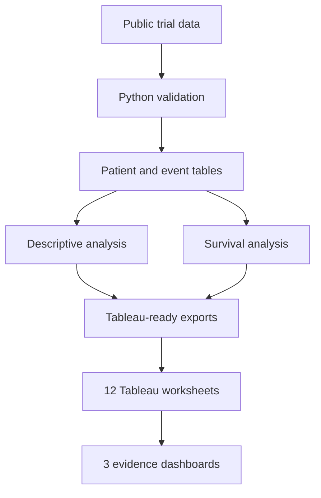

# Clinical Trial Outcomes & Evidence Dashboard

> An end-to-end Python and Tableau portfolio project analysing randomised colon cancer trial data and communicating patient characteristics, data quality, recurrence, survival and treatment-effect evidence through 12 analytical worksheets and three interactive dashboards.


## Project status

**In progress.** The repository currently documents the analytical plan, dashboard architecture and reproducible workflow. Results, dashboard screenshots and verified findings will be added after the analysis has been completed and quality-checked.

## Overview

This project demonstrates how patient-level clinical trial data can be transformed into clear, reproducible and decision-relevant evidence. Python is used for data validation, transformation, exploratory analysis and survival modelling. Tableau is used to communicate the results through an accessible analytical story designed for both technical and non-technical audiences.

The project focuses on five areas:

- Trial population and treatment-arm characteristics
- Data quality, completeness and analytical readiness
- Recurrence and overall-survival outcomes
- Treatment-effect and subgroup analysis
- Transparent communication of uncertainty, assumptions and limitations

This is an independent portfolio analysis for educational purposes. It is not medical advice and should not be used to guide treatment decisions.

## Dataset

The project uses the public `colon` dataset distributed with the R `survival` package. It contains follow-up records from a randomised study of adjuvant treatment for resected colon cancer.

The source data use a repeated-record structure, with separate records representing recurrence and death outcomes. The Python pipeline will reshape these records into analysis-ready patient-level and event-level tables while retaining traceability to the original data.

Dataset documentation: [R survival package — colon dataset](https://stat.ethz.ch/R-manual/R-devel/library/survival/html/colon.html)

Original study reference: [Moertel et al., *Levamisole and Fluorouracil for Adjuvant Therapy of Resected Colon Carcinoma*](https://doi.org/10.1056/NEJM199002083220602)

## Project objectives

1. Build a documented and reproducible clinical-data preparation workflow.
2. Evaluate completeness, consistency and treatment-arm balance before modelling.
3. Describe the trial population and clinically relevant disease characteristics.
4. Compare time-to-event outcomes across treatment groups.
5. Quantify treatment effects with uncertainty rather than relying only on headline percentages.
6. Explore whether estimated treatment effects vary across prespecified patient subgroups.
7. Communicate findings, assumptions and limitations through three Tableau dashboards.

## Research questions

- Are the treatment groups broadly comparable in their observed baseline characteristics?
- How do recurrence and overall-survival patterns differ between treatment groups?
- What are the estimated treatment hazard ratios and their 95% confidence intervals?
- Do age, sex or disease characteristics appear to modify the estimated treatment effect?
- How complete and reliable are the variables required for the analysis?
- Which limitations should be considered when interpreting the evidence?

## Analytical workflow



## Python analysis plan

### 1. Data validation and preparation

- Confirm record counts, unique participant identifiers and outcome-record structure.
- Check duplicate records, impossible values, category consistency and missingness.
- Validate treatment labels and event indicators against the data dictionary.
- Reshape recurrence and death records into documented analytical tables.
- Preserve raw fields and create derived variables through transparent transformation steps.
- Export a data-quality summary and Tableau-ready CSV files.

### 2. Descriptive analysis

- Participant distribution by treatment group
- Age and sex distributions
- Tumour differentiation and extent
- Obstruction, perforation and adherence indicators
- Positive lymph-node burden
- Missing-data patterns by variable and treatment group

### 3. Time-to-event analysis

- Kaplan–Meier estimation for overall survival
- Kaplan–Meier estimation for recurrence-related outcomes
- At-risk counts and event counts over time
- Median survival estimates where estimable
- Cox proportional-hazards models
- Hazard ratios with 95% confidence intervals
- Proportional-hazards diagnostics

### 4. Subgroup analysis

Exploratory treatment-effect estimates will be produced for selected subgroups such as:

- Age group
- Sex
- Number of positive lymph nodes
- Tumour differentiation
- Tumour extent

Subgroup results will be labelled exploratory. Small sample sizes, multiple comparisons and wide confidence intervals will be considered before drawing conclusions.

## Tableau architecture

The final Tableau workbook will contain **12 worksheets and three dashboards**.

### Dashboard 1 — Trial Overview & Data Quality

| Sheet | Worksheet | Purpose |
|---:|---|---|
| 1 | Trial KPI Summary | Display participants, treatment groups, follow-up records, events and key completeness indicators. |
| 2 | Treatment-Arm Distribution | Compare participant counts and proportions across randomised groups. |
| 3 | Age Distribution | Examine age distributions overall and by treatment group. |
| 4 | Missing-Data Profile | Show missingness by variable and treatment group. |

### Dashboard 2 — Patient & Disease Characteristics

| Sheet | Worksheet | Purpose |
|---:|---|---|
| 5 | Sex by Treatment Group | Assess the observed sex distribution across treatment groups. |
| 6 | Tumour Differentiation | Compare differentiation categories across treatment groups. |
| 7 | Tumour Extent | Describe disease extent and its distribution across treatment groups. |
| 8 | Positive Lymph Nodes | Examine lymph-node burden overall and by treatment group. |

### Dashboard 3 — Clinical Outcomes & Treatment Evidence

| Sheet | Worksheet | Purpose |
|---:|---|---|
| 9 | Overall-Survival Curve | Present Python-generated Kaplan–Meier estimates by treatment group. |
| 10 | Recurrence-Free Survival Curve | Compare recurrence-related time-to-event patterns between groups. |
| 11 | Treatment Hazard Ratios | Present model estimates and 95% confidence intervals in a forest plot. |
| 12 | Subgroup Treatment Effects | Show exploratory treatment-effect estimates across patient subgroups. |

## Dashboard interactions

Planned interactions include:

- Treatment-group filters shared across relevant worksheets
- Age, sex and disease-characteristic filters
- Highlight actions between population and outcome views
- Informative tooltips with denominators, events and confidence intervals
- Navigation buttons between the three dashboards
- Reset-filter controls
- Dynamic titles reflecting active selections

## Technology stack

- **Python:** pandas, NumPy, SciPy, statsmodels and lifelines
- **Visualisation and quality assurance:** Matplotlib and Seaborn
- **Dashboarding:** Tableau Public/Desktop
- **Development environment:** Jupyter Notebook
- **Version control:** Git and GitHub

## Planned repository structure

```text
clinical-trial-outcomes-dashboard/
├── README.md
├── LICENSE
├── requirements.txt
├── data/
│   ├── raw/
│   ├── processed/
│   └── tableau_exports/
├── notebooks/
│   ├── 01_data_validation.ipynb
│   ├── 02_exploratory_analysis.ipynb
│   ├── 03_survival_analysis.ipynb
│   └── 04_tableau_exports.ipynb
├── src/
│   ├── data_preparation.py
│   ├── quality_checks.py
│   ├── survival_analysis.py
│   └── export_tables.py
├── tableau/
│   └── clinical_trial_outcomes_dashboard.twbx
├── reports/
│   ├── scientific_summary.pdf
│   └── methodology_and_limitations.md
└── images/
    ├── dashboard_1_overview.png
    ├── dashboard_2_population.png
    └── dashboard_3_outcomes.png
```

## Reproducibility

After the analysis files have been added, the project will be reproducible using the following steps:

```bash
git clone https://github.com/USERNAME/clinical-trial-outcomes-dashboard.git
cd clinical-trial-outcomes-dashboard
python -m venv .venv
source .venv/bin/activate
pip install -r requirements.txt
```

Run the notebooks in numerical order or use the Python modules in `src/` to reproduce the processed datasets and Tableau exports.

## Data-quality principles

- The raw dataset will remain unchanged.
- Every derived field will be documented.
- Patient-level and repeated outcome records will be handled separately.
- Denominators and event definitions will be stated with every reported measure.
- Missing observations will not be silently converted into valid categories or zeros.
- Model assumptions and analytical decisions will be recorded.
- Results will be checked against independently calculated summary tables before publication.

## Interpretation principles

- Estimates will be presented with confidence intervals wherever possible.
- Association, estimation and causal interpretation will be clearly distinguished.
- Subgroup findings will not be presented as confirmatory evidence.
- Statistical significance will not be treated as the only measure of importance.
- Findings will be interpreted in the context of the study design, available variables and historical dataset.

## Limitations

- This is a secondary analysis of an existing historical clinical-trial dataset.
- The available variables may not capture every clinically relevant confounder or outcome.
- Subgroup analyses may have limited statistical power and will be exploratory.
- Proportional-hazards models depend on assumptions that require diagnostic assessment.
- Tableau visualisations communicate the analysis but do not replace the underlying statistical methodology.
- The results should not be generalised beyond the study population without appropriate clinical and methodological review.

## Deliverables

- [ ] Reproducible Python data-validation workflow
- [ ] Documented patient-level and event-level analytical datasets
- [ ] Descriptive and survival-analysis notebooks
- [ ] Twelve Tableau worksheets
- [ ] Three interactive Tableau dashboards
- [ ] Tableau Public link
- [ ] Dashboard screenshots
- [ ] Scientific summary with methods, results and limitations
- [ ] Final quality-assurance review

## Results

Results will be added only after the full analysis and validation workflow has been completed. This section will report verified population characteristics, event counts, survival estimates, treatment-effect estimates and confidence intervals without overstating the evidence.

## Author

**Tanishk Nanasaheb Shinde**  
MSc Data Science, University of Bristol  

LinkedIn, GitHub profile and Tableau Public links will be added before final publication.

---

*Portfolio project for demonstrating clinical-data analysis, statistical reasoning, data-quality assurance and evidence communication. Not medical advice.*
